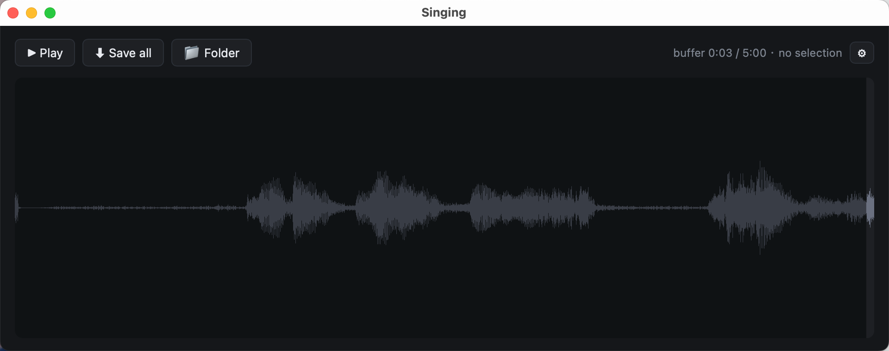

<div align="center">

# 🎙 Singing

**后台滚动录音的桌面玩具 · 想起来就打开听，找到好段就保留。**

[](#)
[](https://tauri.app)
[](https://www.rust-lang.org)
[](#license)

</div>

---

## 为什么有这个

哼到一段好听的旋律，想录下来——打开录音 app 已经过去 10 秒，那段没了。

Singing 是个挂在菜单栏的小程序，**默默录下最近 10 分钟的麦克风音频**到内存里。等你想起来，打开窗口看波形，圈一段，存成 WAV。

不做 AI，不做云，不做转录。一个图标，一个窗口，一个文件夹。

> 这是给自己做的玩具，不是产品。

---

## 截图

<p align="center">
  <em>（暂无）</em>
</p>

<!-- 想加图：把 docs/screenshot.png 放进去后改成
<p align="center"></p>
-->

---

## 功能

- 🎚️ **10 分钟滚动 buffer**（可在设置里改 5/15/30/60 分钟）
- 📈 **实时波形** + 拖选 + 段内播放
- 💾 **保存选段或全段** 到 WAV（16kHz 单声道）
- ⚙️ **可配置**：输入设备、保存文件夹、buffer 长度、默认播放时长
- 🖥 **菜单栏托盘** + 窗口关闭即隐藏（不打断录音）
- 🔒 **本地**：不联网，不上传，不分析
- 🪶 **轻量**：内存 ~20 MB（10 min buffer），Rust 原生二进制

---

## 安装

下载预编译的 `.app`（待发 Releases）或自己 [从源码构建](#build-from-source)。

首次启动会弹麦克风权限，允许即可。

---

## 用法

| 操作 | 怎么做 |
|---|---|
| 看波形 | 启动后窗口自动出现 |
| 选段 | 在波形上按住拖动 |
| 取消选段 | 单击波形 或 按 `Esc` |
| 播放 | `▶ Play` 或 `Space`（没选段时播最近 N 秒） |
| 保存 | `⬇ Save`（有选段存选段，没选段存全段）或 `⌘S` |
| 打开保存文件夹 | `📁 Folder` |
| 调设置 | `⚙` |
| 关窗但继续录 | 关闭按钮（隐藏到托盘） |
| 重新打开 | 点菜单栏托盘 |
| 退出 | 托盘 → Quit |

---

## 设置

点工具栏 `⚙` 弹出浮层：

| 项目 | 默认 | 说明 |
|---|---|---|
| Input device | 系统默认 | 切麦克风（清缓冲） |
| Save folder | `~/Music/Captures` | 文本框直接改 或 📁 系统选择器 |
| Buffer length | 10 分钟 | 5 / 10 / 15 / 30 / 60 分钟（改了清缓冲） |
| Default play length | 30 秒 | 没选段时 Play 播最近 N 秒 |

配置持久化在：
```
~/Library/Application Support/com.singing.toy/config.json
```

---

## Build from source

依赖：[Rust](https://rustup.rs)（稳定版）、Node 20+、[bun](https://bun.sh) 或 npm。

```bash
git clone <your-repo-url> singing
cd singing
bun install                              # 装 Tauri CLI
bun tauri build --debug --bundles app    # 产物在 src-tauri/target/debug/bundle/macos/
open src-tauri/target/debug/bundle/macos/Singing.app
```

**开发模式**（热重载，但麦克风权限继承自父进程即终端）：

```bash
bun tauri dev
```

**发布构建**：

```bash
bun tauri build --bundles app
# → src-tauri/target/release/bundle/macos/Singing.app
```

---

## 项目结构

<details>
<summary>展开</summary>

```
singing/
├── README.md
├── package.json             ← Tauri CLI 依赖
├── dist/                    ← 前端（纯静态 HTML/CSS/JS，无构建步骤）
│   ├── index.html
│   ├── styles.css
│   └── main.js
└── src-tauri/
    ├── Cargo.toml
    ├── tauri.conf.json
    ├── Info.plist           ← macOS 麦克风权限说明
    ├── capabilities/        ← Tauri 2 权限
    ├── icons/
    └── src/
        ├── main.rs          ← 入口
        ├── lib.rs           ← Tauri commands · tray · window
        ├── audio.rs         ← cpal 采集 · ring buffer · WAV
        └── config.rs        ← 配置读写
```

</details>

---

## 技术栈

| 层 | 选择 | 备注 |
|---|---|---|
| 应用框架 | [Tauri 2](https://tauri.app) | Rust 后端 + WebView 前端 |
| 音频采集 | [cpal](https://crates.io/crates/cpal) | 跨平台麦克风 |
| WAV 编码 | [hound](https://crates.io/crates/hound) | 零依赖 PCM |
| 文件夹选择器 | tauri-plugin-dialog | 系统原生 |
| 波形渲染 | Canvas 2D | 自己写的，约 30 行 |
| 播放 | HTML5 `<audio>` + Blob URL | WAV 字节流通过 Tauri IPC 回传 |

整个 Rust 后端约 400 行，前端约 250 行。

---

## 故意不做的

- ❌ 静音检测 / 自动切段
- ❌ 转录 / AI 分析
- ❌ 云同步 / 多设备
- ❌ 手机端
- ❌ 文件管理界面（保存到固定文件夹，自己用 Finder 看）

这些是**故意**不做，不是没来得及做。要更复杂的功能请用 [ListenBack](https://apps.apple.com/app/listenback)、[MonkeyC Rewind](https://www.monkeyc.com) 之类。

---

## 可能会做

只有真正用了一段时间觉得痛的时候才考虑加：

- [ ] 波形上标出"有声音"的段（amplitude threshold）
- [ ] 全局快捷键一键保存最近 N 秒（不开窗）
- [ ] Windows / Linux 构建

---

## License

[MIT](LICENSE)
